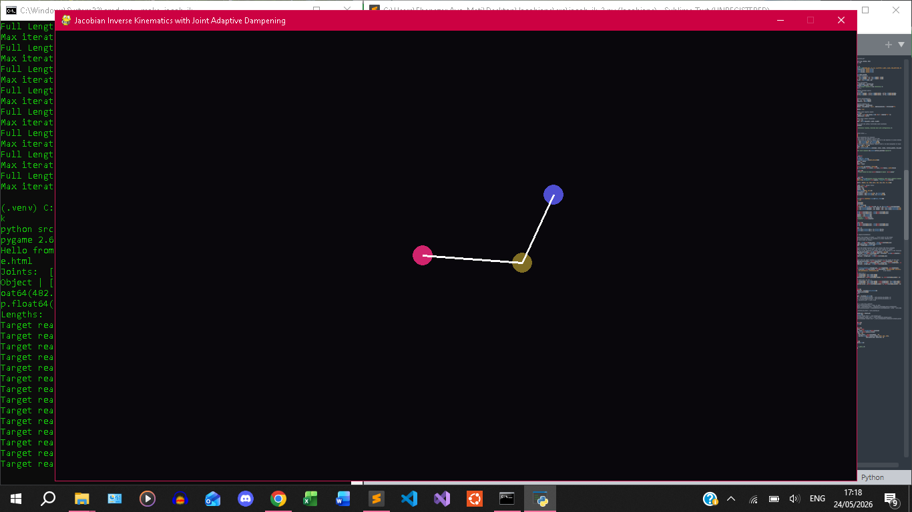
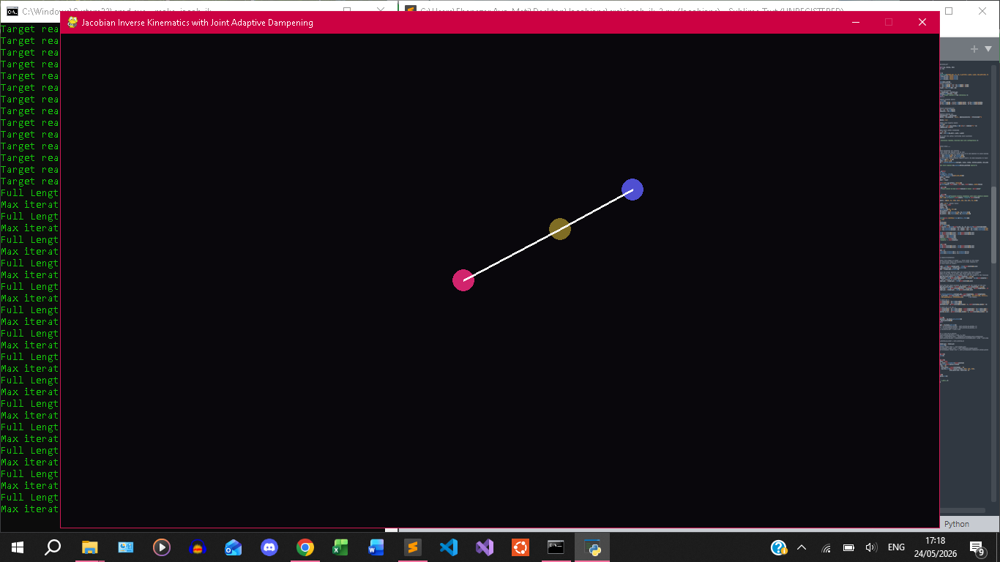
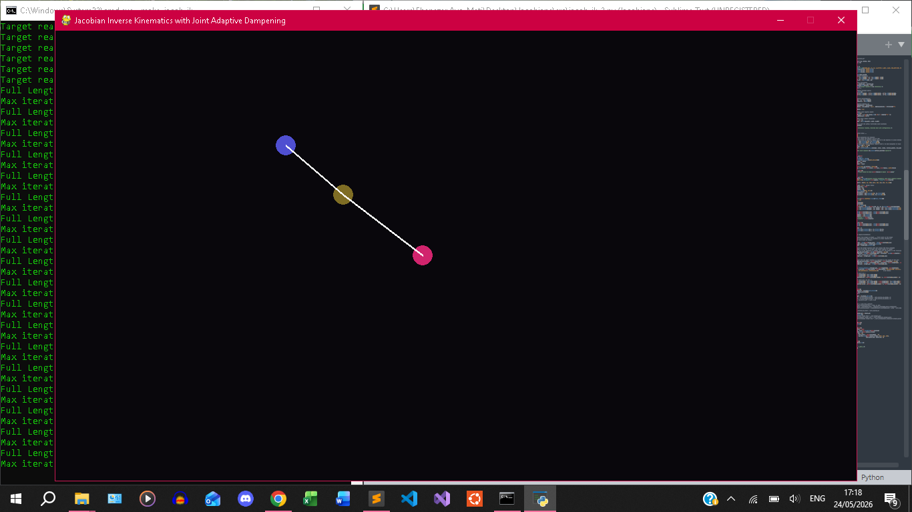
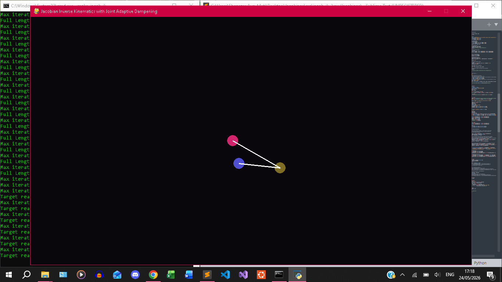
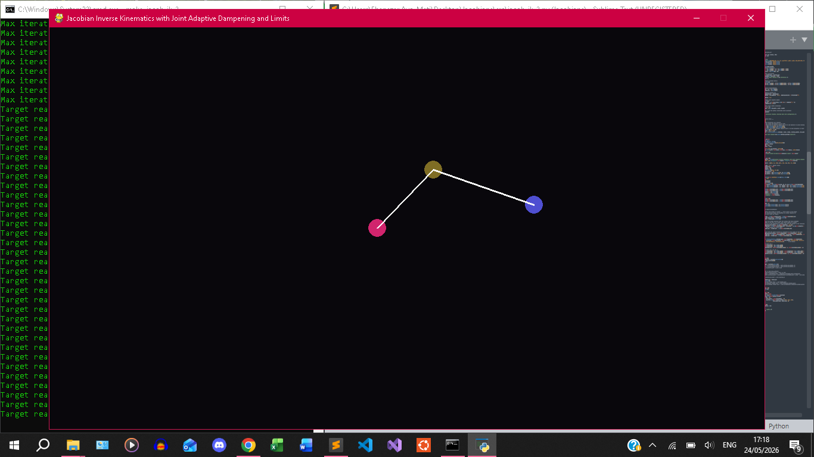
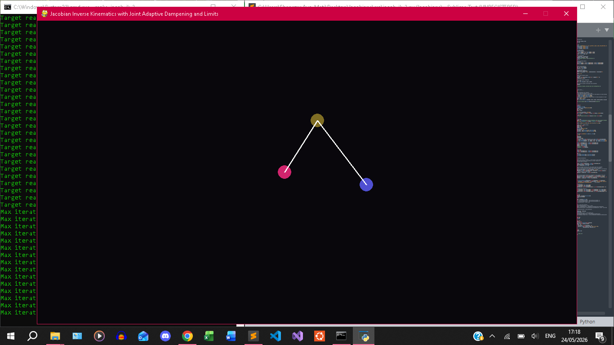
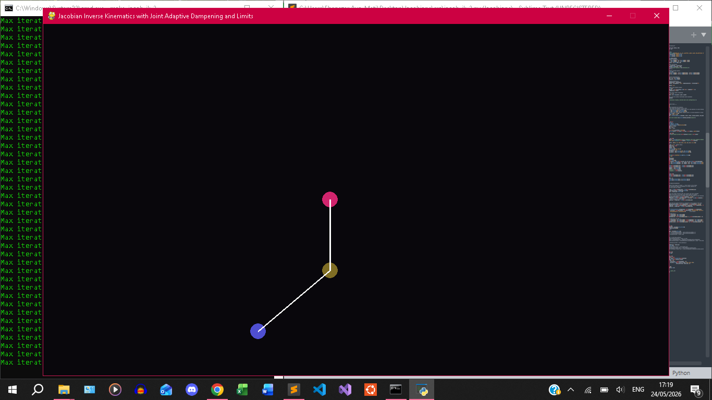

####	Date: 24-05-2026

##	Jacobians Quest - Using Jacobians for Inverse Kinematics

##	Setup
>	Install Python
>	Install Pip
>	Install Make either by msys64, on wsl, or Linux environment
1.	Create * Activate Environment:
	-	`python -m venv .venv`
	-	`.venv\Scripts\activate.bat`
2.	Install Dependencies:
	-	`pip install -r requirements.txt`
3.	Run (in root directory) using Make:
	-	`make jacob_fk`
	-   `make jacob_fk_3_arm`
	-	`make jacob_ik`
	-	`make jacob_ik_2`
	+	Or Run using Python if can't install Make:
	-	`python src/jacob_fk.py`
	-	`python src/jacob_fk_3_arm.py`
	-	`python src/jacob_ik.py`
	-	`python src/jacob_ik_2.py`

####	References

+	Google Gemini

####	Screenshots

